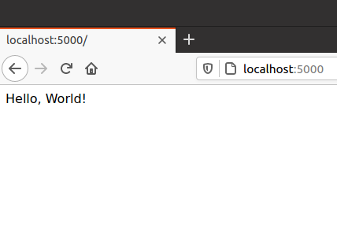
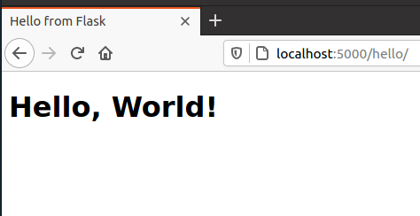
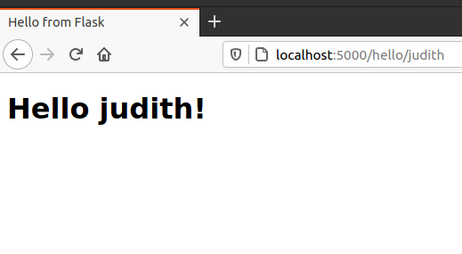

# extremely-simple-flask-tutorial

I just wanted to test how Flask runs so I made this extremely simple Flask tutorial.

## How to run (Ubuntu 20.04)

Create conda environment with Flask and run

```
$ conda env create -f environment.yml
$ FLASK_APP=hello.py python -m flask run
```

You can see the output log

```
 * Serving Flask app "hello.py"
 * Environment: production
   WARNING: This is a development server. Do not use it in a production deployment.
   Use a production WSGI server instead.
 * Debug mode: off
 * Running on http://127.0.0.1:5000/ (Press CTRL+C to quit)
```

## Screenshots

Different results come from different URLs

1. localhost:5000

    

2. localhost:5000/hello

    

3. localhost:5000/hello/judith

    
